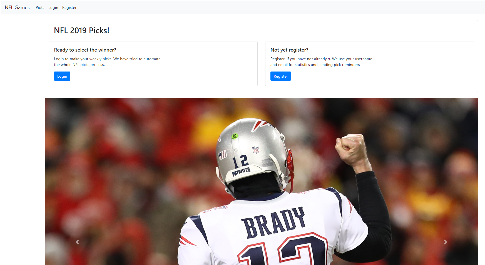
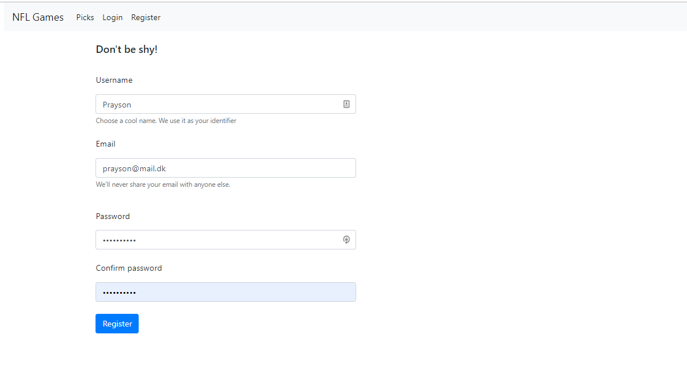
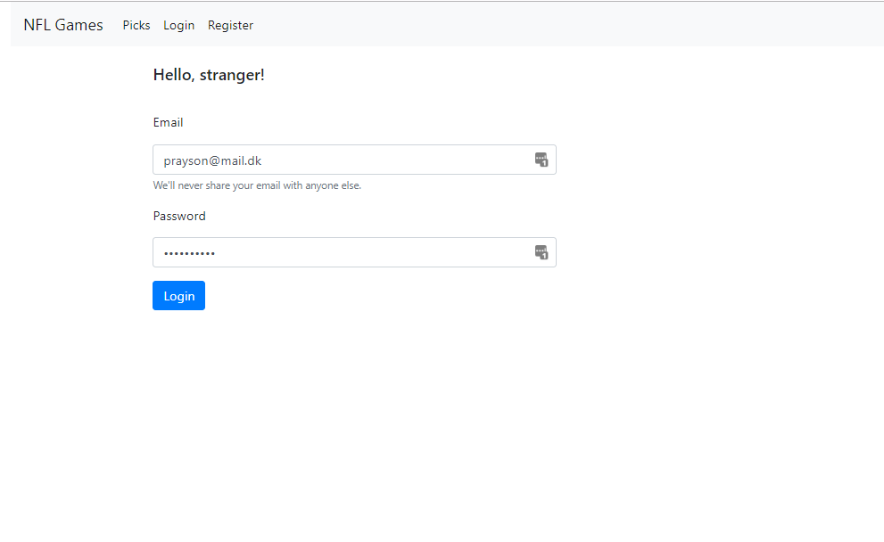
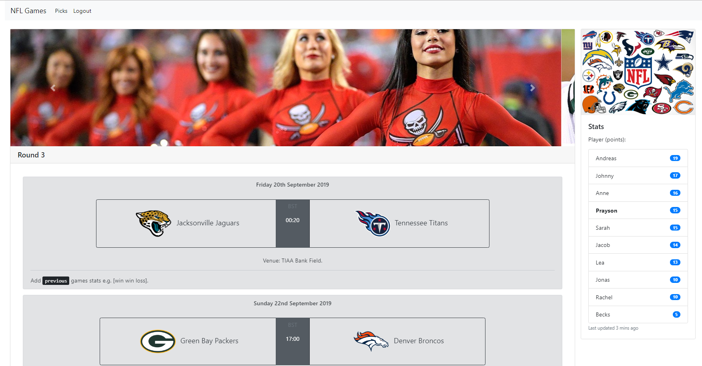
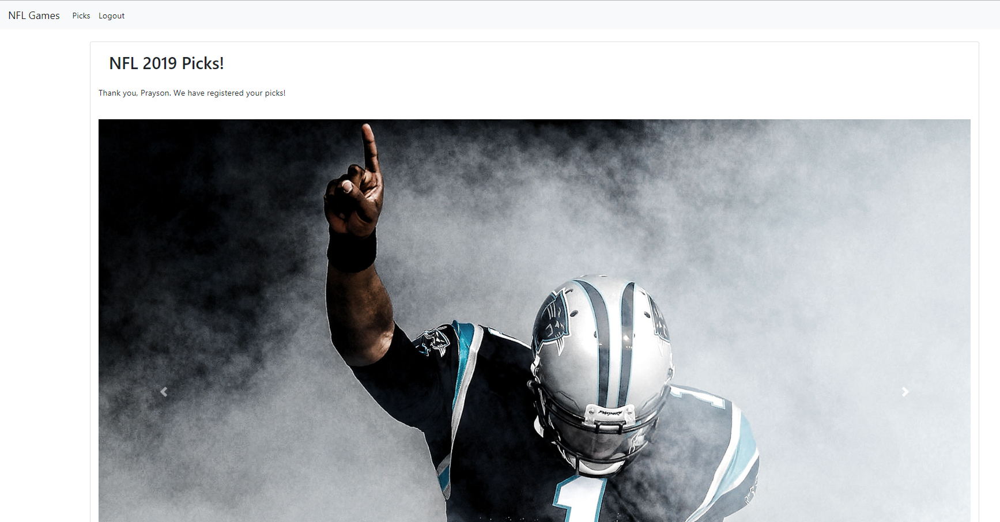

# NFL Picks: Home Baked
> A simple end-to-end flask based NFL Picks web application



After TV2 stopped their NFL Picks web services, we were left with googlesheets to do our family NFL picks league. My hate of repetitive tasks led to this Flask project. At the core, I allow users to register, store their hashed passwords, and allow them to pick the winning NFL teams in each round. Fixtures and results data comes directly from BBC.co.uk  

## Run Via Docker

We have a docker image ready. Building image will install packages, create database, and expose the app to port 5000 

```bash
docker build -t nflpicks:latest .
docker run -d -it --name nfl -p 80:5000 nflpicks
```
Open localhost on your browser. NFL Pick pages awaits.

## Used Packages Python 3.7
```bash
beautifulsoup4            4.7.1
flask                     1.1.1                     
flask-login               0.4.1  
flask-migrate             2.5.2  
flask-sqlalchemy          2.4.0  
flask-wtf                 0.14.2
lxml                      4.3.4
pandas                    0.25.0
requests                  2.21.0
```
# Start DataBase & Run locally

```bash
# clone repository and change directory
git clone https://github.com/Proteusiq/NFLPicks.git
cd NFLPicks
# create python environment with Python version 3.6+
conda create -n nfl python=3.7
conda activate nfl

# install requirements
pip install -r requirements

# set environment variables
export FLASK_APP=app.py # for run `flask run`
export FLASK_DEBUG=1 # for debugging (Never in production)

# set up migration directory and initiate local sqlite database
python manager.py -db start

# run application
flask run
```
Note: `export` is `set` in Windows


# See Data with sqlite

```python
import sqlite3

with sqlite3.connect('nflpicks/data/data.sqlite') as f:
    c = f.cursor()
    users = c.excute("SELECT * FROM users")
    print(users.fetchall())
```

# See Data with Pandas

```python
import sqlite3
import pandas as pd

with sqlite3.connect('nflpicks/data/data.sqlite') as f:
    user = pd.read_sql("SELECT * FROM users", f)

print(users.head()) # first 5 users
```

# Demo Pages
### Register


### Login


### Rounds


### Thanks



# TODO

[ ] Code refactoring
[ ] Statitic Page
[ ] Faster loading of fixtures and results


## Meta

Prayson W. Daniel – [@Proteusiq](https://twitter.com/proteusiq) – praysonwilfred@gmail.com

Distributed under the MIT license. See ``LICENSE`` for more information.

[https://github.com/Proteusiq/sentimentapi](https://github.com/proteusiq/)

## Contributing

1. Fork it (<https://github.com/Proteusiq/NFLPicks/fork>)
2. Create your feature branch (`git checkout -b feature/fooBar`)
3. Commit your changes (`git commit -am 'Add some fooBar'`)
4. Push to the branch (`git push origin feature/fooBar`)
5. Create a new Pull Request
